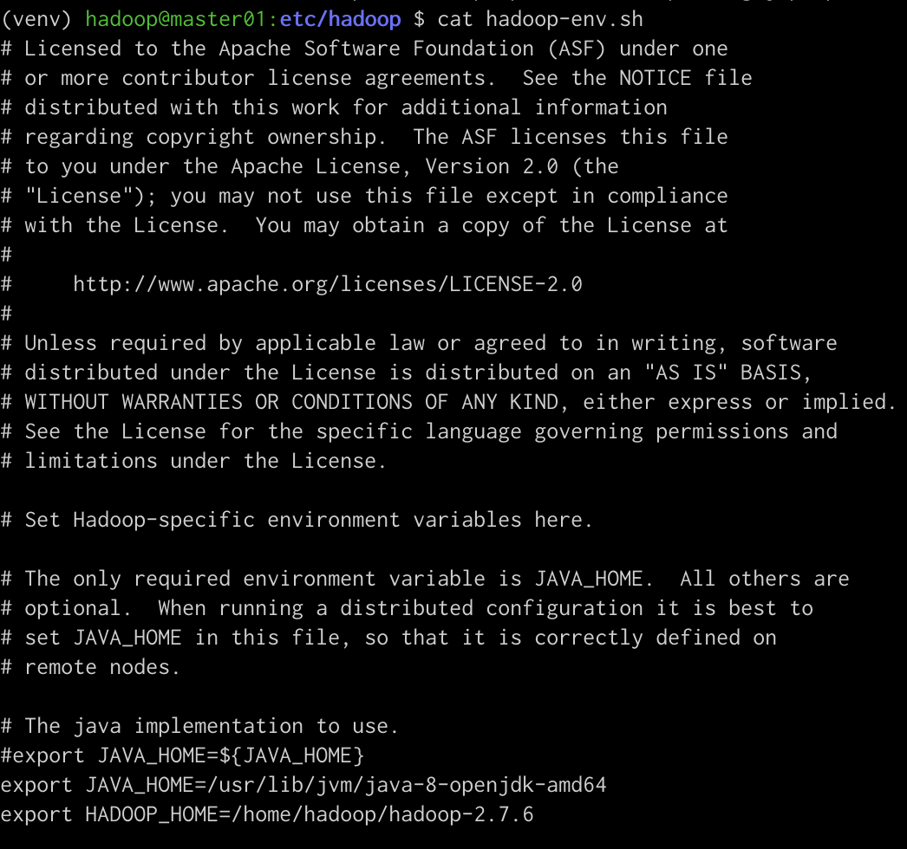
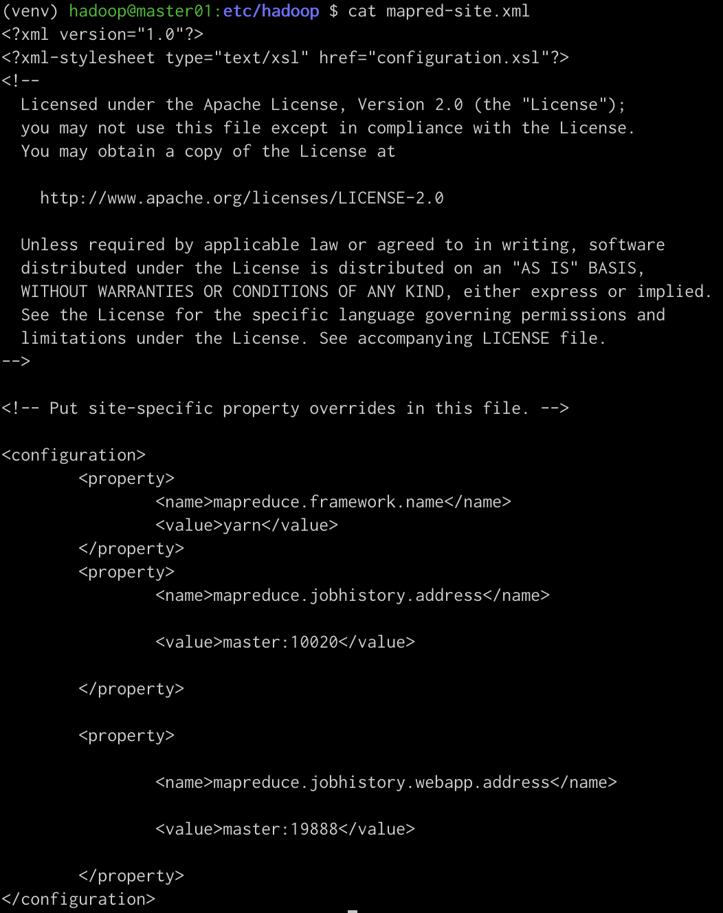
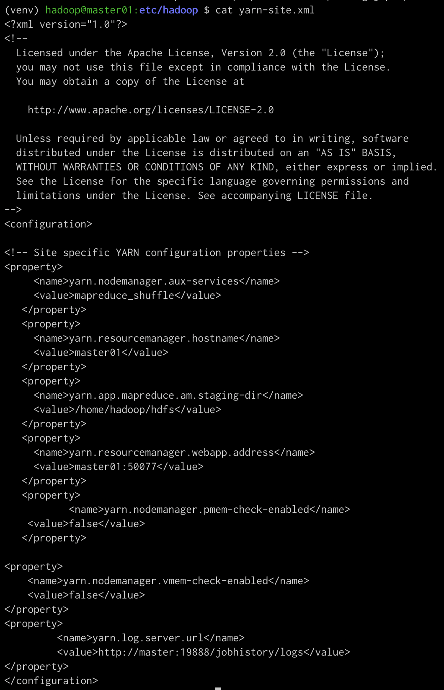
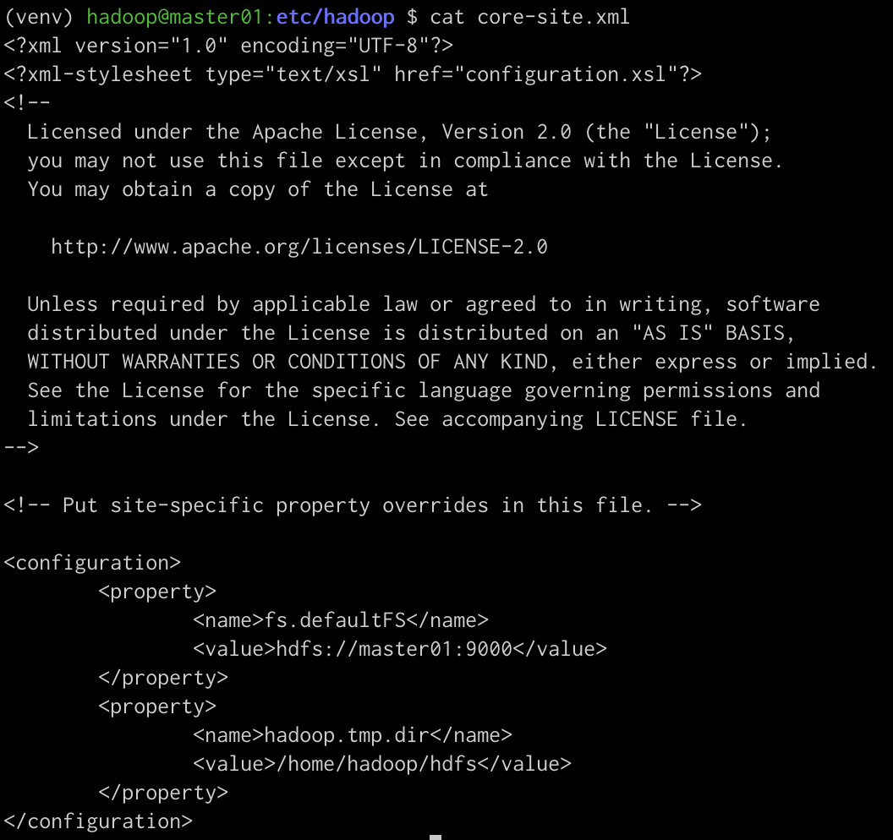
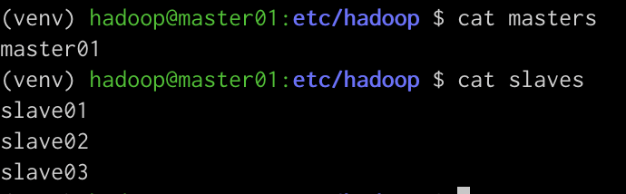
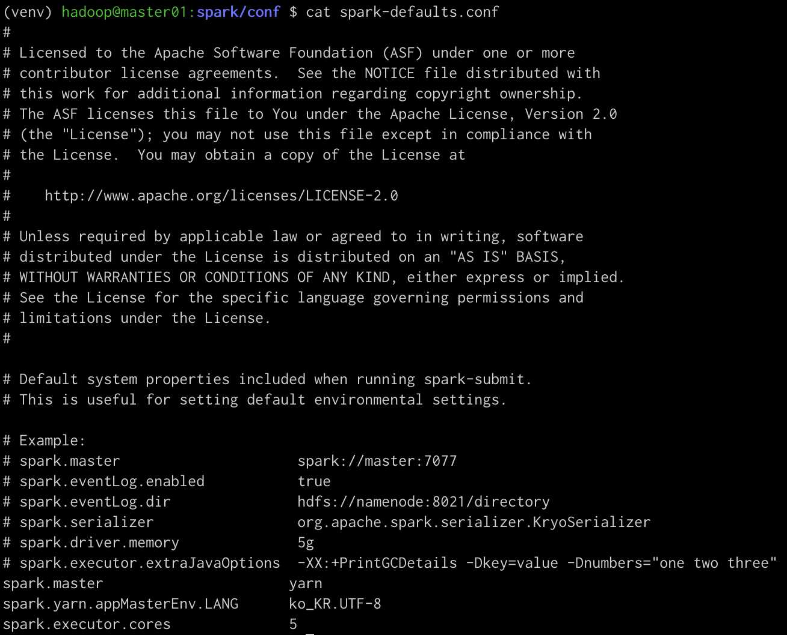
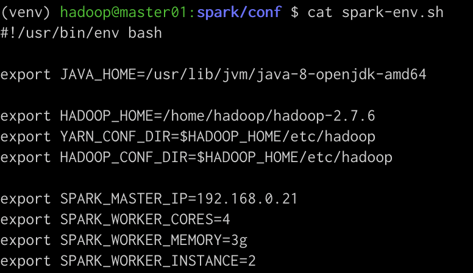
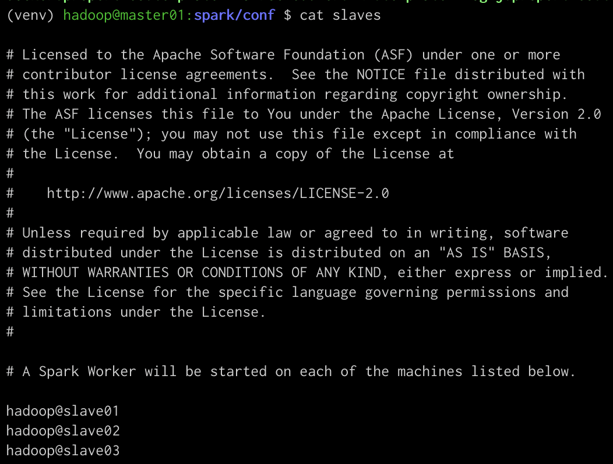
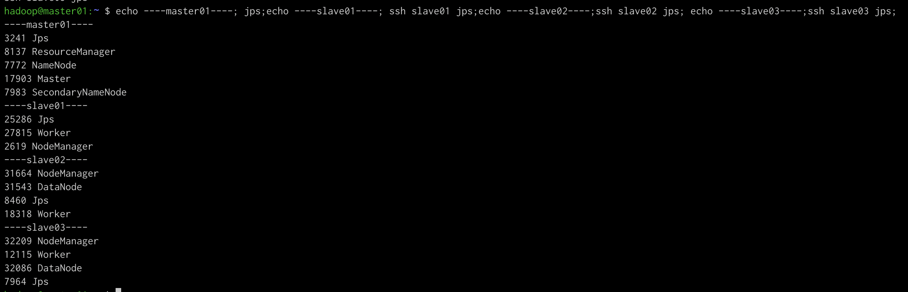
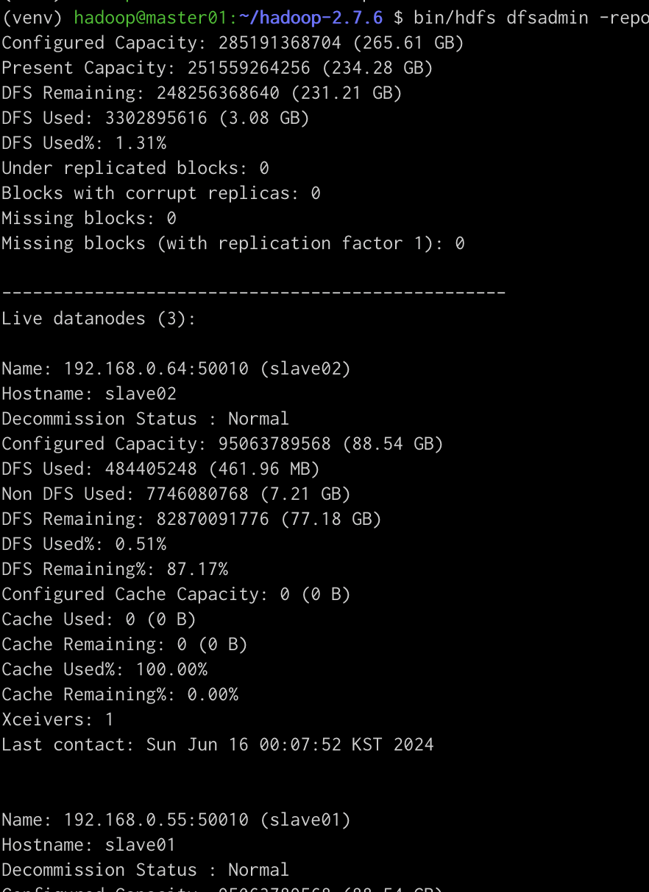

# Spark Processing

## [INFoU 바로가기](https://github.com/philip-lee-khu/2024-BIGDATA-PROJECT-5)

스파크 및 HDFS 세팅과 결과물 정리

목차

- [HDFS 세팅](#HDFS-세팅)
- [SPARK 세팅](#SPARK-세팅)
- [결과 화면](#결과-화면)
- [실행](#실행)

## HDFS 세팅

1. hadoop-env.sh

   

2. mapred-site.xml

   

3. yarn-site.xml

   

4. core-site.xml

   

5. masters & slaves
   

## Spark 세팅

1. spark-defaults.conf

   

2. spark-env.sh

   

3. slaves

   

## 결과 화면

다음과 같이 나오면 성공이다.

1. jps

   

2. dfsadmin

   

## 실행

```sh
spark/bin/spark-submit \
--master yarn \
--deploy-mode cluster \
--conf spark.yarn.appMasterEnv.LANG=ko_KR.UTF-8 \
--conf spark.yarn.appMasterEnv.PYSPARK_PYTHON=venv/bin/python \ #상대 경로
--conf spark.executorEnv.PYSPARK_PYTHON=venv/bin/python \ #상대 경로
--archives venv.tar.gz#venv \  #상대 경로
example.py
```

- `master yarn: Spark` : 애플리케이션의 마스터 URL을 설정, 이 옵션은 YARN 클러스터 관리자를 사용하여 작업을 실행하도록 지정
- `deploy-mode cluster` : 애플리케이션의 배포 모드를 설정, cluster 모드는 드라이버 프로그램이 클러스터의 워커 노드 중 하나에서 실행
- `conf spark.yarn.appMasterEnv.PYSPARK_PYTHON=venv/bin/python `: YARN 애플리케이션 마스터의 환경 변수를 설정, 이 경우, PYSPARK_PYTHON 환경 변수를 애플리케이션 마스터가 사용할 파이썬 인터프리터로 설정(아래 심볼릭 링크 지정으로 경로를 현재경로인 ./ 로 시작)
- `conf spark.executorEnv.PYSPARK_PYTHON=venv/bin/python`: Spark 실행자의 환경 변수를 설정, 이 경우, 실행자가 사용할 파이썬 인터프리터를 설정(아래 심볼릭 링크 지정으로 경로를 현재경로인 ./ 로 시작)
- `archives venv.tar.gz#venv` : 애플리케이션에 필요한 압축된 아카이브를 추가하고, 심볼릭 링크를 생성, 이 경우, Python 가상 환경이 포함된 venv.tar.gz 파일이 추가되고, venv라는 심볼릭 링크가 생성
